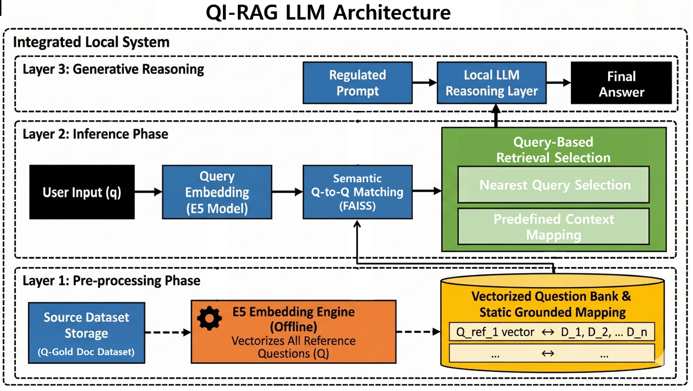
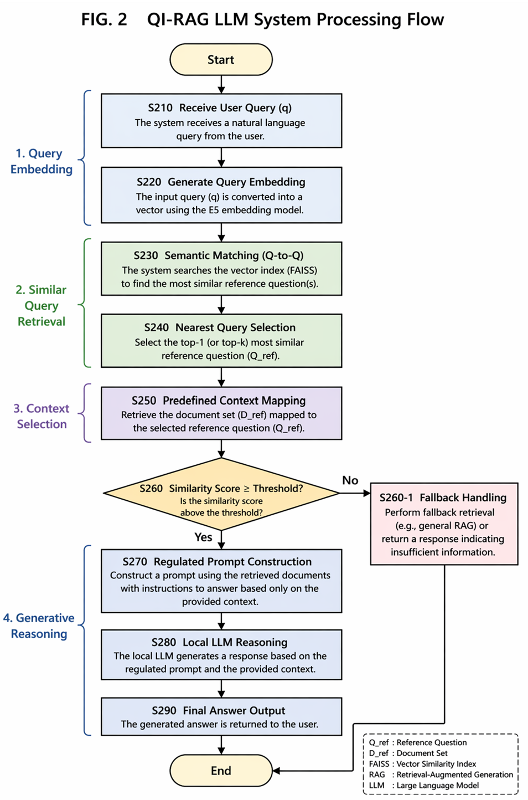

# QI-RAG: Query-Indexed Retrieval-Augmented Generation(2026.4)

## Overview
QI-RAG is a retrieval framework that indexes queries instead of documents.
It is designed to improve robustness under noisy queries and reduce hallucination in large language models (LLMs).

## Key Idea
Unlike standard RAG, which retrieves documents directly, QI-RAG:
- Matches input queries to pre-indexed queries
- Uses pre-mapped document sets
- Controls retrieval structure explicitly

## Architecture

## Flow

## Features
- Query-indexed retrieval
- Robust to noisy queries
- Reduced hallucination via constrained context
- Structured retrieval pipeline

## Implementation Note
This repository provides a simplified implementation for research purposes.

## Installation
pip install -r requirements.txt

## Usage
python demo/demo.py

## Results
QI-RAG demonstrates improved robustness compared to standard RAG
under noisy and adversarial query settings.

## Contact 
Jun-Hyeong Lee

yjhboky@gmail.com
